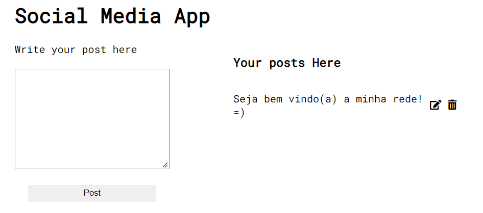

# crud_basics

Aplicação [guiada](https://www.freecodecamp.org/news/learn-crud-operations-in-javascript-by-building-todo-app/), apresentando os conceitos básicos de CRUD (Create, Read, Update, Delete)
 
Tutorial dividido em 2 aplicações, esta é a primeira.
 

Tecnologias usadas:
 

Preview:
 
</img>
